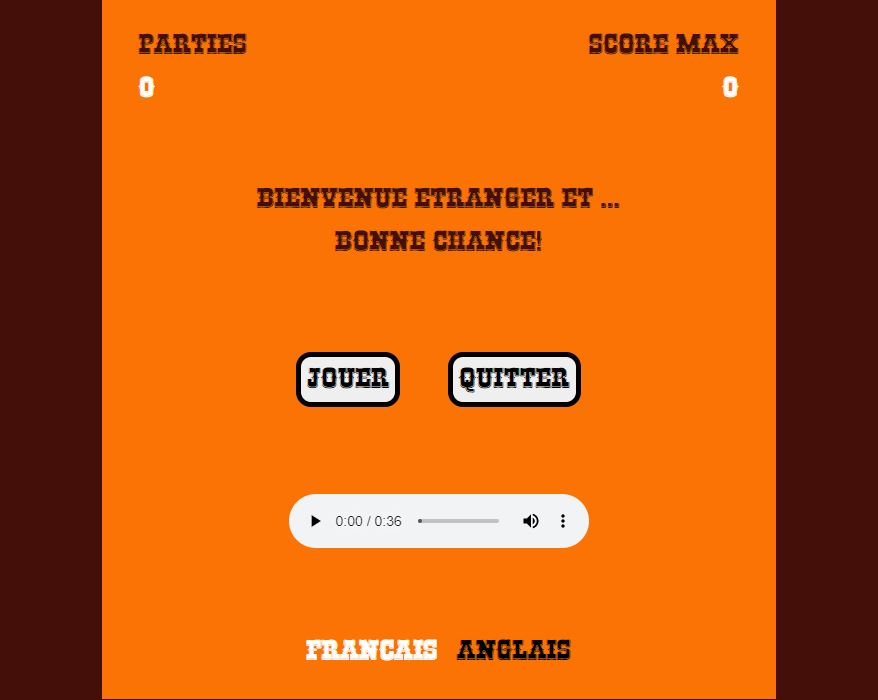
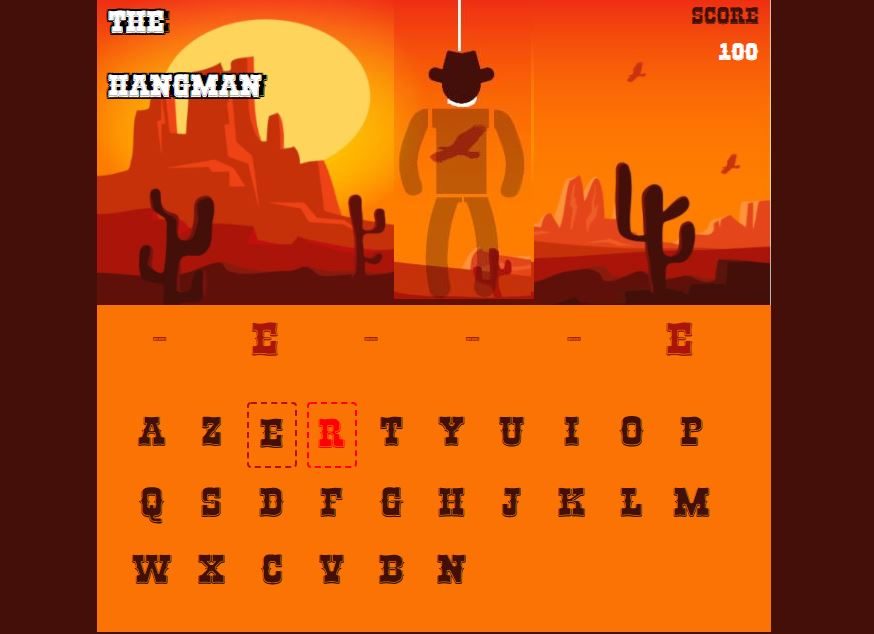
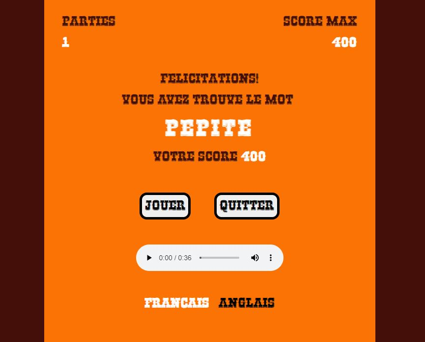
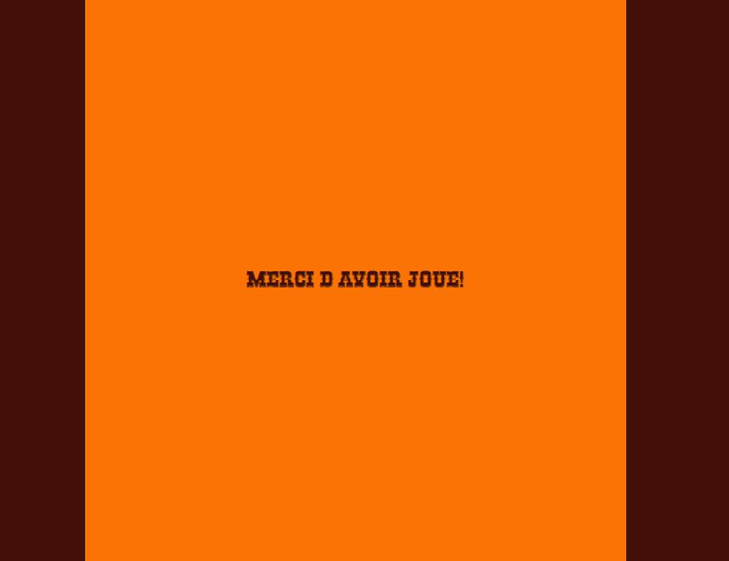

# Hangman
## Training at Becode.org (jan - oct 2021)
> This 3 days project took place at the beginning of our training : 09-10-11 february 2021 and was a solo project.

## Project

>The purpose of this Javascript challenge was to realize a website version of the "hangman" word game.

## Specifications

> This version should at least:
> * propose an hidden word
> * allow the selection of letters
> * verify if a selected letter belongs to the word
> * count the number of failure (lives)
> * check if it's a game over
> * check if the word as been found
>
> and optionally :
> * keep in memory all guessed letters
> * only let the player guess a letter once
> * add an image for each step
> * check keyboard recognition
>
> Bonus :
> * use canvas
>
## Team's members -> Solo project

* [Stéphane Englebert](https://github.com/stephane-englebert)

## Used languages

> * HTML5
> * CSS3
> * Javascript
> * Bootstrap

## HTML Page

[HTML Webpage](https://stephane-englebert.github.io/hangman/)

## Screenshots
> 
>
>
> 
>
>
> 
>
>
> 

## Credits

> Font "Rio Grande" :
> * [Anton Krylov - on dafont.com](https://www.dafont.com/fr/rio-grande.font)
>
> Picture "Natural background with desert landscape" :
> * https://www.freepik.com/free-vector/natural-background-with-desert-landscape_5223882.htm
>
>Cowboy SVG Vector : 
> * https://www.svgrepo.com/svg/258250/cowboy
>
> Music sample & sounds :
>
> * "Gun Cock" + "Layered Gunshot" for sounds : 
> https://samplefocus.com/tag/gun#
>
> * Music "Western type acoustic guitar" : 
> https://www.looperman.com/loops/detail/210815/western-type-acoustic-guitar-105bpm-acoustic-acoustic-guitar-loop
>